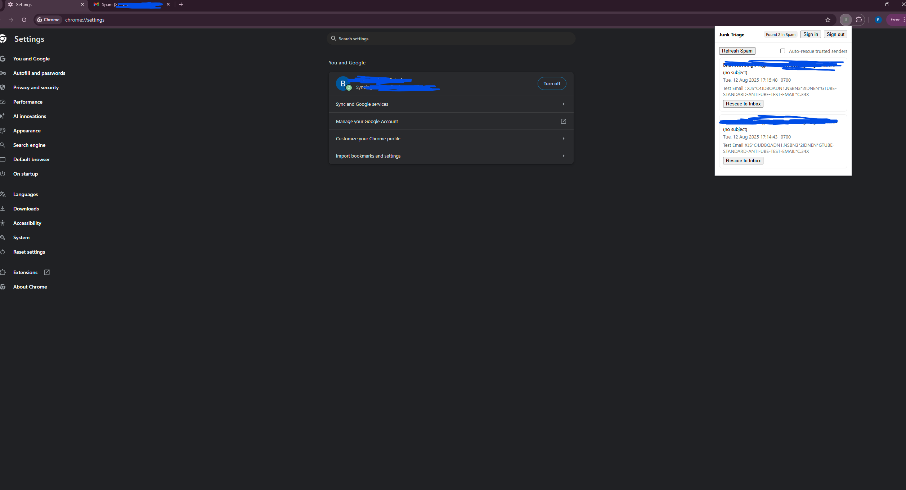

# Junk Triage – Gmail Spam Rescue Chrome Extension

## 📌 Overview
Ever missed an important email because it landed in your **Spam** folder with no notification?  
This Chrome extension helps you **quickly review and rescue legitimate emails** from your Gmail Spam folder back to your Inbox.

The goal is to make sure important messages are never lost, while still keeping junk out.

---

## ✨ Features
- **OAuth Sign-in with Gmail** (least-privilege scopes: `gmail.readonly` & `gmail.modify`)
- **List emails in Spam** with From, Subject, Date, and snippet
- **Rescue to Inbox** with one click (removes `SPAM` label, adds `INBOX` label)
- **Sign out** to revoke access any time
- Local storage of OAuth tokens (no server involved)

---

## 🛠️ Installation & Setup

### 1. Clone this repository
```bash
git clone https://github.com/r8bhavneet/Email-Triage.git
cd Email-Triage
```


## 📷 Screenshot

Here’s how the extension looks when listing spam emails:


